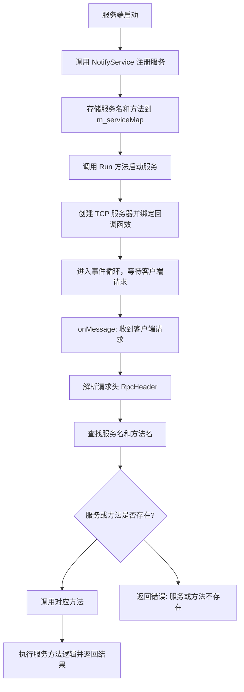

# 大系统的软件模块怎么划分？各模块可能会实现大量重复的代码

各模块都运行在不同的进程里（如docker虚拟化环境中），各模块之间该怎么访问呢？

机器1上的模块怎么调用机器2上的模块的一个业务方法？

机器1上的一个模块进程1怎么调用机器1上的模块进程2里面的一个业务方法呢？

解答：这就是本项目要实现的分布式网络通信框架的作用！让具体的远程函数调用透明化


以业务为驱动，明确为什么要这么做

bin：可执行文件

build：项目编译文件

lib：项目库文件

src：源文件

test：测试代码

example：框架代码使用范例

CMakeLists.txt：顶层的cmake文件

README.md：项目自述文件

autobuild.sh：一键编译脚本


# RpcProvider 工作流程与架构

## 工作流程



---

## 架构图

```mermaid
graph TD
    subgraph Client
        C1[客户端应用]
        C2[发起 RPC 请求]
    end

    subgraph RpcProvider
        RP1[RpcProvider]
        RP2["ServiceInfo 注册表"]
        RP3[NotifyService 注册服务]
        RP4[Run 启动服务]
        RP5[onMessage 处理请求]
        RP6[SendRpcResponse 返回结果]
    end

    subgraph Muduo
        M1[EventLoop 事件循环]
        M2[TcpServer 监听客户端请求]
        M3[TcpConnection 网络连接]
    end

    subgraph UserService
        U1[UserService]
        U2[Login 方法]
        U3[GetFriendList 方法]
    end

    C1 -->|RPC 请求| C2
    C2 -->|"网络请求: 服务名+方法名+参数"| M2
    M2 -->|交给 RpcProvider 处理| RP5
    RP5 -->|解析请求| RP2
    RP2 -->|查找服务和方法| U1
    U1 -->|调用方法| U2
    U2 -->|返回结果| RP6
    RP6 -->|序列化结果| M3
    M3 -->|发送结果| C1
```# grpc
